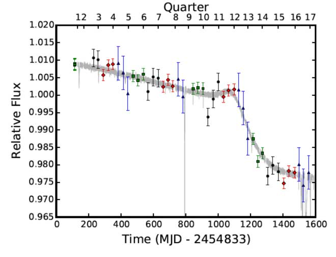
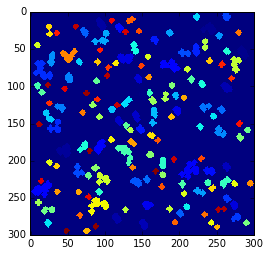
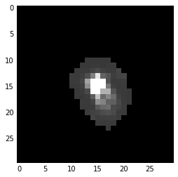
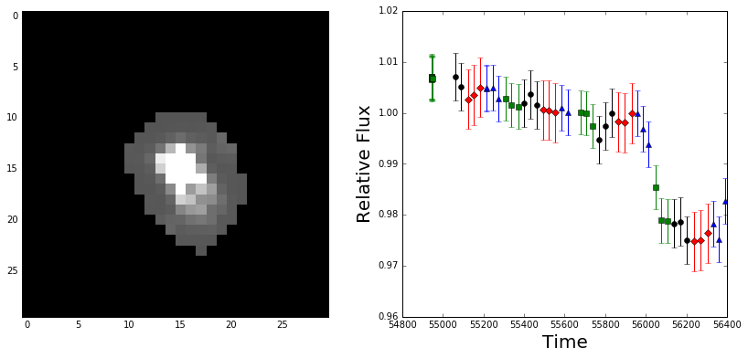
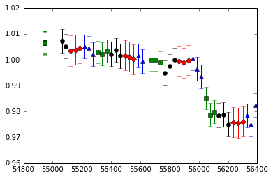
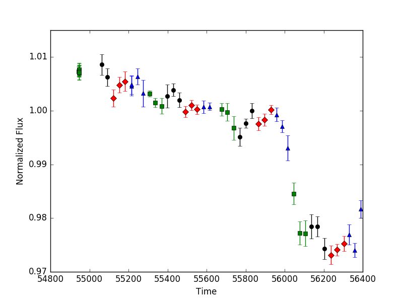

.. note:: This tutorial is based on an IPython notebook that can be
          downloaded `here <https://github.com/benmontet/f3/blob/master/demo.ipynb>`_.

Tutorial
=========

For this tutorial, we will do photometry on KIC 8462852, sometimes called "Tabby's Star" or 
"Boyajian's Star." We'll see if we can reproduce the long-term dimming detected by
Montet and Simon (2016, ApJL, 830, 39; arXiv:1608.01316), shown below

The FFIs here are represented by the points labeled with green squares, black circles, red diamonds, 
and blue triangles, corresponding to the four different orientations of the Kepler spacecraft during
its data-collecting primary mission.

The first thing we'll do (after importing the module, of course) is instantiate the f3 "star" class. 

.. code:: python

    from f3 import photometry
    target = photometry.star(8462852, ffi_dir='../kepler_ffis/')
    
We've created an object called target, defined our target based on its KIC, and pointed the object
to the directory where we store our Full Frame Images. By default, f3 will look for the FFIs in the
"ffidata" subdirectory of your working directory, so if they're already there, you don't need to 
pass through this information.

"target" has various data and methods attached to it. At any time, we can find a list of those

.. code:: python
  
    dir(target)

.. parsed-literal::

    ['__class__', '__delattr__', '__dict__', '__doc__', '__format__', '__getattribute__', '__hash__', '__init__', '__module__', '__new__', '__reduce__', '__reduce_ex__', '__repr__', '__setattr__', '__sizeof__', '__str__', '__subclasshook__', '__weakref__', 'adjust_aperture', 'calc_centroids', 'calc_fluxes', 'data_for_target', 'define_spotsignal', 'do_photometry', 'do_rolltest', 'ffi_dir', 'find_other_sources', 'generate_panel', 'kic', 'make_postcard', 'mini_lc', 'obs_filenames', 'onclick', 'qs', 'times', 'year']

You'll see some python defaults, some info we've supplied (for example, ``target.kic`` is equal to ``8462852``), and some functions we
will shortly run.

Let's try one of these. We'll make a postcard region of data (which is bigger than a traditional Kepler postage stamp)

.. code:: python

    target.make_postcard()
    

The step above takes all the FFIs and locates a small region centered on the target. It takes three optional arguments. 
npix is the size of the square postcard region. shape=(1070,1132) is the size of the FFIs, which can be changed if 
you're adapting the code to something other than Kepler FFIs (such as TESS data). buffer_size avoids the outermost 
pixels on the detector, so that each target should have its entire PSF on the detector.

If you run ``dir(target)``, you'll now see additional data: ``target.postcard`` and ``target.integrated postcard``, 
which ``np.shape`` will show you have shapes ``(52, 300, 300)`` and ``(300, 300)``---this is the postcard region 
and the same region summed over all observations and collapsed into 2d, representing effectively a 26 hour integration
with Kepler.

Now that we have our postcard, let's find all the sources on it.

.. code:: python
    
    target.find_other_sources(plot_flag=True)

This step will draw apertures around the target star and up to ``ntargets`` additional targets on the same postcard. 
It will then remove apertures that touch the border of the postcard and combine apertures that touch into one target, 
treating those stars as a single object for the rest of the procedure.

The ``plot_flag`` argument will show a stacked plot of the postcard images, then a plot of all apertures for all 
targets, then a plot of the default aperture for the primary target, and finally data for the entire postcard, 
with apertures for all targets highlighted over the data, as shown below.

.. image:: f2.png

.. image:: f5.png

Now that we know where our target star is and where our reference stars are, it's time to do photometry!
Perhaps the initial aperture isn't appropriate, because it contians another star or doesn't capture the entire PSF, 
for example. In this case, we can use ``adjust_aperture`` to adjust the aperture. It will open up a window showing 
the aperture (and underlying data) and the current light curve for the target star. By clicking on individual pixels, 
you can include or exclude them from the aperture. Closing the panel will then cause the photometry pipeline to re-run, 
and you can see how the light curve has changed from including/excluding those pixels. This will repeat until the 
image is closed without any changes to the aperture.

Clicking on the zeroth row/column (on the top or left) will cause all pixels in that column/row (respectively) to be 
turned off. Re-running ``find_other_sources`` will restart this procedure, giving you back the default aperture.

.. code:: python
    
    target.adjust_aperture()

The times of observations will then be found in ``target.times``, and the flux values in ``target.obs_flux``. 
You'll also find a few other new variables in there, which include the raw flux for the target star and for the 
reference stars, before using the reference stars as calibrators. 
Everything should slowly be decreasing in that case, which I think is due to degradation of the detector in the
harshness of space. ``target.flux_uncert`` will give you an estimate of the uncertainties from fitting a line to the 
data and estimating the scatter around that line. 

Instead of ``adjust_aperture`` we could run ``data_for_target`` instead, which produces the same results without
the abilities for the user to view and adjust the aperture.

Let's see how it looks!

.. code:: python

    fmt = ['ko', 'rD', 'b^', 'gs']

    for i in range(4):
        g = np.where(target.qs == i)[0]
        plt.errorbar(target.times[g], target.obs_flux[g], yerr=target.flux_uncert[i], fmt=fmt[i])
        

This looks like the result from Montet and Simon! 
The error bars are overestimated in this case---they represent the residuals to a linear fit to the data, 
which is clearly inappropriate for this star. We can use the data to estimate the uncertainties, following
the appendix in our paper.

.. code:: python
    
    target.model_uncert()

This will create an array called ``modeled_uncert`` which we can use as our uncertainties.

.. code:: python

    for i in range(4):
        g = np.where(a.qs == i)[0]
        plt.errorbar(a.times[g], a.obs_flux[g], yerr=a.target_uncert[g], fmt=fmt[i])
        

Looks reasonable!

With this, you can produce simple photometry for all stars in the Kepler field. Feel free to play around with it,
try some of the different flags available in each of the steps, and see where ``f3`` succeeds and where it struggles
(namely, faint stars in crowded fields, when the star's PSF is encroached on by another star of equal or greater
brightness). If you have any ideas on improvement, feel free to fork the repository and create a pull request.
